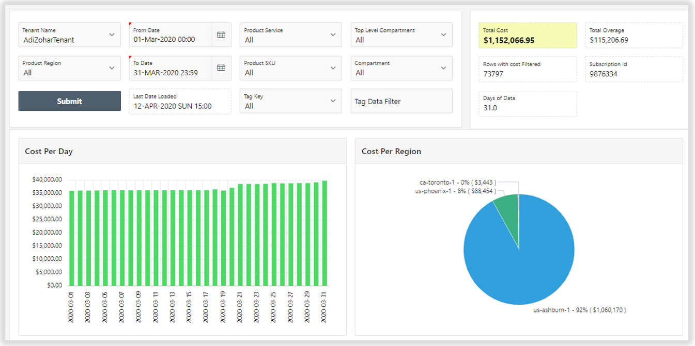
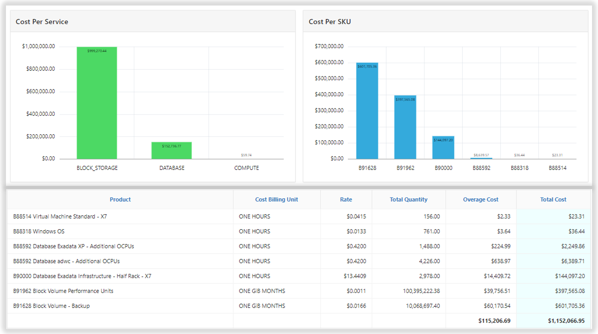
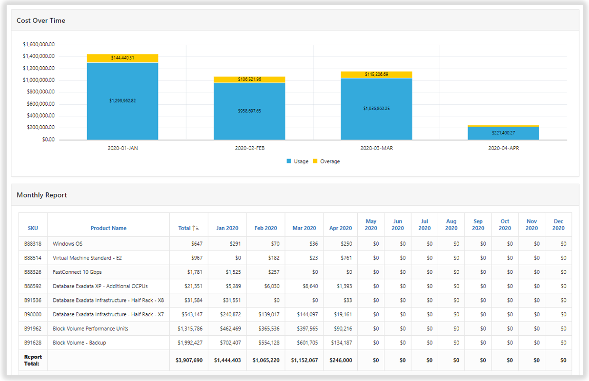
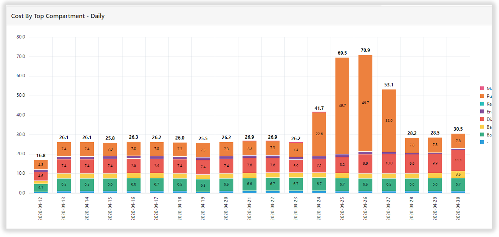
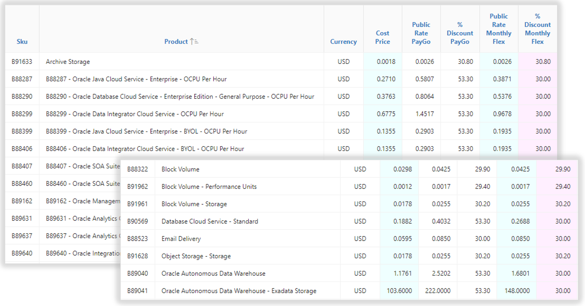
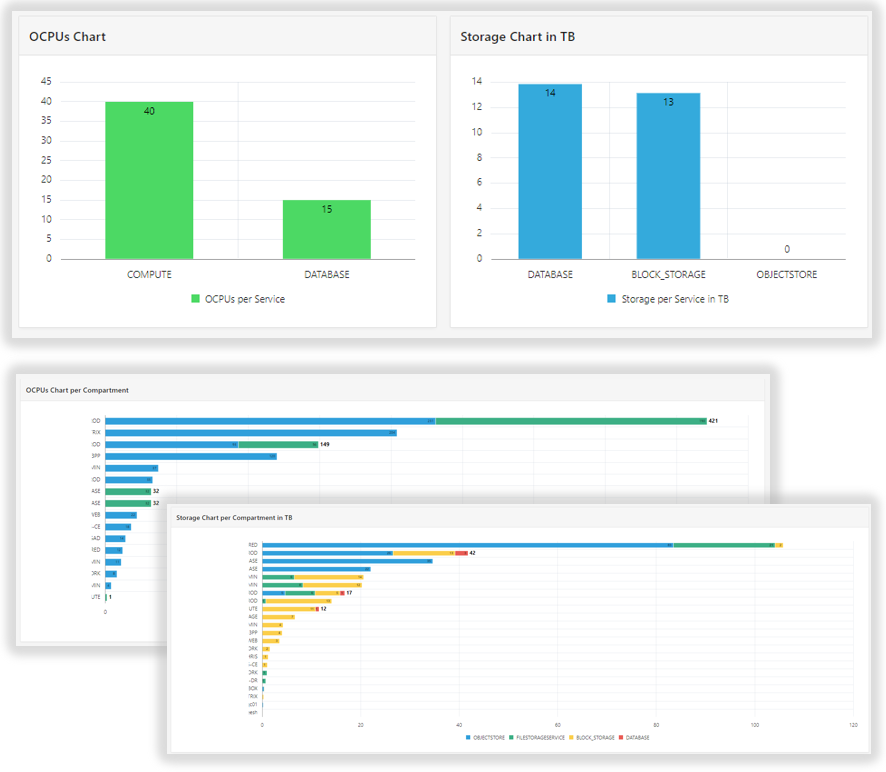
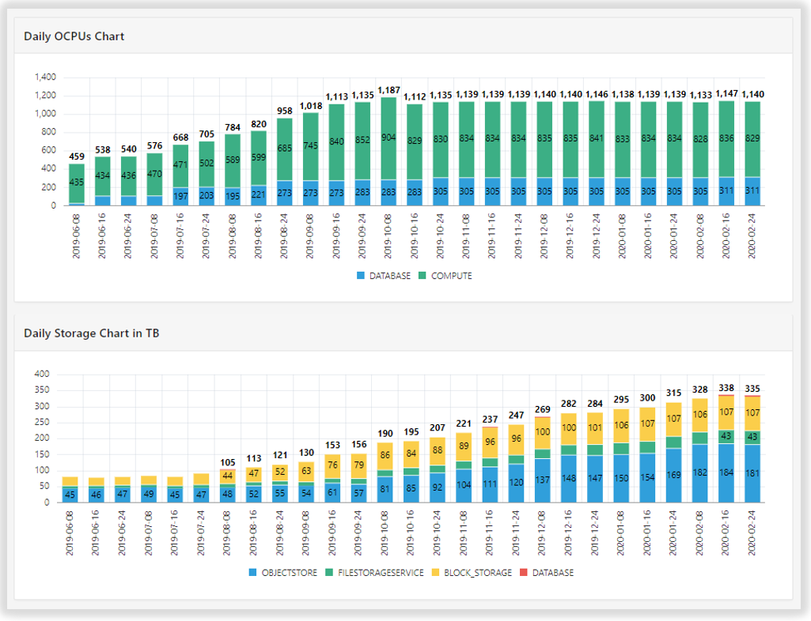

# Usage2ADW - Oracle Cloud Infrastructure Usage and Cost Reports to Autonomous Database Tool

## Introduction
Usage2adw is a tool which uses the Python SDK to extract the usage and cost reports from your tenant and load it to Oracle Autonomous Database. (DbaaS can be used as well)
Authentication to OCI by User or instance principals.

It uses APEX for Visualization and generates Daily e-mail report.

**DISCLAIMER - This is not an official Oracle application,  It does not supported by Oracle Support, It should NOT be used for utilization calculation purposes, and rather OCI's official
[cost analysis](https://docs.oracle.com/en-us/iaas/Content/Billing/Concepts/costanalysisoverview.htm) 
and [usage reports](https://docs.oracle.com/en-us/iaas/Content/Billing/Concepts/usagereportsoverview.htm) features should be used instead.**

**Developed by Adi Zohar, 2020-2023**

## Main Features
- Usage Current State
- Usage Over Time
- Cost Analysis
- Cost Over Time
- Rate Card for Used Product
- ShowOCI Data (If Enabled)

## Cost Reports

## Rate Card

## Usage Reports

## Daily E-Mail Report

## Usage Reports Overview
A usage report is a comma-separated value (CSV) file that can be used to get a detailed breakdown of resources in Oracle Cloud Infrastructure for audit or invoice reconciliation.

## How Usage Reports Work
The usage report is automatically generated daily, and is stored in an Oracle-owned Object Storage bucket. It contains one row per each Oracle Cloud Infrastructure resource (such as instance, Object Storage bucket, VNIC) per hour along with consumption information, metadata, and tags. Usage reports generally contain 24 hours of usage data, although occasionally a usage report may contain late-arriving data that is older than 24 hours.

More information can be found at [usagereportsoverview.htm](https://docs.cloud.oracle.com/en-us/iaas/Content/Billing/Concepts/usagereportsoverview.htm)

## Installation Documentations

1. [Step by Step using Resource Management (Terraform)](step_by_step_terraform.md)

2. [Step by Step Installation](step_by_step_installation.md)

3. [Step by Step Manual Installation](step_by_step_manual_installation.md)

4. [Step by Step How to File](step_by_step_howto.md)

## OCI SDK Modules and API used:

- IdentityClient.list_compartments - Policy COMPARTMENT_INSPECT
- IdentityClient.get_tenancy       - Policy TENANCY_INSPECT
- ObjectStorageClient.list_objects - Policy OBJECT_INSPECT
- ObjectStorageClient.get_object   - Policy OBJECT_READ
- SecretsClient.get_secret_bundle  - Policy SECRET_BUNDLE_READ

- Rest API Used - [Accessing List Pricing](https://docs.oracle.com/en-us/iaas/Content/GSG/Tasks/signingup_topic-Estimating_Costs.htm#accessing_list_pricing)

## Database Tables

- OCI_USAGE - Raw data of the usage reports
- OCI_USAGE_STATS - Summary Stats of the Usage Report for quick query if only filtered by tenant and date
- OCI_USAGE_TAG_KEYS - Tag keys of the usage reports
- OCI_COST - Raw data of the cost reports
- OCI_COST_STATS - Summary Stats of the Cost Report for quick query if only filtered by tenant and date
- OCI_COST_TAG_KEYS - Tag keys of the cost reports
- OCI_COST_REFERENCE - Reference table of the cost filter keys - SERVICE, REGION, COMPARTMENT, PRODUCT, SUBSCRIPTION
- OCI_PRICE_LIST - Has the price list and the cost per product
- OCI_LOAD_STATUS - Has the load file statistics

## 3rd Party Dependencies including tested versions

- Python 3.9.13_2
- oracledb 1.3.0
- requests 2.28.2
- OCI Python SDK 2.98.0

## Contributing

Usage2ADW utility is an open source project.
Oracle gratefully acknowledges the contributions to Usage2ADW utility that have been made by the community.
Before submitting a pull request, please [review our contribution guide](./CONTRIBUTING.md)

## Security

Please consult the [security guide](./SECURITY.md) for our responsible security vulnerability disclosure process

## Known Issues
None

## License

Copyright (c) 2023, Oracle and/or its affiliates. 
Licensed under the Universal Permissive License v 1.0 as shown at  https://oss.oracle.com/licenses/upl/ 

See [LICENSE](./LICENSE.txt) for details.

